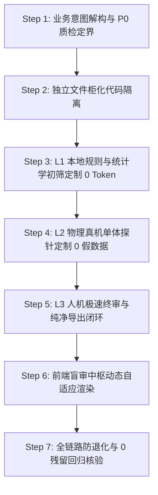

# 🛠️ RPA 任务质检与盲审定制标准作业程序 (Task Quality & Blind Audit SOP)

> **设计哲学**：在实际业务中，自动化需求千变万化，试图提前预设一个“全知全能的通用超级模型”往往会导致严重过度设计与跨品类误判。
> **核心原则**：“每个任务针对性定制，依托文件隔离管理面条代码；分层防御骨架（L1➔L2➔L3）全局统一，绝不从零重构。”

---

## 🧭 核心交付物与目录结构规范

每当新增或定制一个独立 RPA 采数任务（如 `pdd_beer_top15`、`bilibili_monitor`）时，遵循“独立文件柜化管理”：

```text
手机端项目/
├── <task_name>_crawler.py              # 采数主脚本 (端侧/PC 自动化)
├── backend/
│   ├── evaluators/                     # 📂 独立的 L1 规则评估器目录
│   │   └── <task_name>_evaluator.py    # 任务专属 L1 毫秒级规则 (0 Token)
│   └── probes/                         # 📂 独立的 L2 真机物理探针目录
│       └── <task_name>_probe.py        # 任务专属 L2 真机原子回放探针
└── .agents/skills/rpa-task-quality-customizer/
    ├── SKILL.md                        # 本标准作业程序
    ├── references/quality_archetypes.md# 四大通用质检模态速查手册
    └── examples/                       # 标准评估器与探针代码模板
```

---

## 📋 标准定制七步走 (The 7-Step SOP)



---

### Step 1: 业务意图解构与 P0 质检定界 (Intent & Archetype)

在写任何质检代码前，必须与用户或业务逻辑对齐以下三个底层事实：
1. **核心业务真理 (Ground Truth)**：本次采数最关注的指标是什么？
   - 是真实成交售价？是榜单连号与热度？是播放量三连？还是系统权限？
2. **第一致命假数据形态 (P0 Risk)**：
   - 虚假低配引流？榜单跳号漏榜？跨品类杂质渗入？还是页面未加载完成出空白？
3. **确定质检模态原型**（详见 [quality_archetypes.md](./references/quality_archetypes.md)）：
   - `SPEC_FRAUD_DEFENSE` (电商规格与防引流类)
   - `RANK_HOTNESS_INTEGRITY` (榜单排名与品类纯正度类)
   - `SOCIAL_METRIC_MONITOR` (社交互动与内容表现类)
   - `SYSTEM_TELEMETRY` (系统环境与健康巡检类)

---

### Step 2: 独立文件柜化隔离 (File-based Modularization)

严禁在全局核心文件（如 `quality.py`、`item_replay_runner.py`）中无限堆叠 `if script == 'pdd_gpu': ... elif script == 'beer': ...`。
- **采集脚本**：在完成数据抓取后，调用 `save_audit_batch` 写入 SQLite `data_audits`，必须显式传入独立的 `script_name` 与 `task_title`；
- **评估器解耦**：创建独立的 `backend/evaluators/<task_name>_evaluator.py`；
- **探针解耦**：若需要真机回放，创建独立的 `backend/probes/<task_name>_probe.py`。

---

### Step 3: L1 本地极速规则定制 (0 Token / 毫秒级初筛)

参考 [evaluator_template.py](./examples/evaluator_template.py) 编写 L1 规则：
1. **成本原则**：0 Token 消耗，纯本地计算，耗时 < 10ms；
2. **漏斗防御**：自动放行 80%~90% 干净合规数据（打标 `PASS`），仅将 ~10% 核心存疑或异常项送审（打标 `NEED_AUDIT` 或 `REJECT`）；
3. **品类隔离铁律**：
   - 非显卡类任务，**绝对严禁**引入 `12G/16G`、`7500元` 等魔数；
   - 榜单类任务重点校验 `rank` 连续性与黑名单关键词一票否决；
   - 连续型指标采用自适应 IQR 箱线图：$[Q1 - 1.5 \times IQR, Q3 + 1.5 \times IQR]$。

---

### Step 4: L2 物理真机单体探针定制 (Zero Hallucination Physical Probe)

参考 [probe_template.py](./examples/probe_template.py) 编写 L2 探针：
1. **真实物理驱动断言**：
   - 执行前断言真机 ADB 连接，离线直接报错中断，**坚决杜绝 PIL 自绘暗色假图与伪造公式**；
2. **针对性物理交互**：
   - **电商规格类**：真机进入商品详情页 ➔ 展开 SKU 抽屉 ➔ 本地 RapidOCR 识别 ➔ 点击目标规格 ➔ 截取联动变价过程；
   - **榜单排名类**：真机拉起目标榜单页 ➔ 滚动到目标名次 ➔ 截取榜单原画 ➔ 核验该商品是否真实在榜（**严禁让啤酒探针去商品详情页点 16G 显存！**）；
   - **社交监控类**：真机定位至视频主页 ➔ 截取最新播放与互动树；
3. **原子 3 步存证证据链**：
   - 步骤 1 (定位复位) ➔ 步骤 2 (穿透交互) ➔ 步骤 3 (读数确认)；每步保存真机 100% 原始截图；
4. **物理读数最高真理权**：
   - 真机测得的真实值作为最终纠偏值；DeepSeek 官方大模型仅负责结合证据链出具高置信度归因与代码修改建议。

---

### Step 5: L3 人机极速终审与纯净导出闭环 (Human-in-the-Loop)

1. **零摩擦极速操作**：
   - 前端终审界面对齐键盘快捷键：`[空格]` 一键采纳 AI 裁决，`[1]` 确认通过，`[2]` 剔除驳回；
2. **纠偏即时入库**：
   - 人工点击或采纳纠偏后，修正数值（纠偏价或修正排名）直接更新至 SQLite `modified_price`，状态更新为 `APPROVED`；
3. **交付端到端过滤**：
   - 导出纯净版 Excel（`/api/reports/{script_name}/excel-clean`）时，严格过滤所有 `human_action == 'REJECTED'` 剔除项，并优先应用修正数值。

---

### Step 6: 前端盲审中枢自适应渲染适配 (Dynamic Schema UI)

在 `frontend/index.html` 盲审视图中，确保无显卡硬编码泄漏：
1. **顶部大盘指标条自适应**：
   - 显卡任务：`基准中位数: ¥9,899 | 16G 纯净率: 88%`
   - 啤酒榜单：`榜单连号率: 15/15 | 品类纯正度: 100% | 热度覆盖率: 100%`（**严禁显示 ¥9,989**）；
2. **核心数值列自适应 (第 4 列)**：
   - 根据当前脚本任务模态，动态呈现标价、榜单位次、或播放三连数据；
3. **操作区自适应**：
   - 纠偏按钮动态显示对应业务文案（「采纳纠偏价」vs「确认在榜」）。

---

### Step 7: 全链路防退化与 0 残留回归自检 (Zero-Regression Checklist)

每次交付新采数任务质检后，必须逐项执行以下自检清单：
- [ ] **数据库隔离核验**：SQLite `data_audits` 中新增的数据记录，`script_name` 准确无误，未误写为旧脚本名；
- [ ] **显卡硬编码 0 残留**：非显卡品类的 L1 风险标签、L2 诊断与前端卡片中，`12G`、`16G`、`显存`、`7500` 残留量严格为 0；
- [ ] **物理探针真实验证**：针对 1 件存疑数据触发单品重跑探针，现场生成 3 张真实真机原画（单张 > 500KB），绝无暗色假图；
- [ ] **纯净报表导出核验**：下载导出的 Excel 表格，Sheet 名称与数据字段与当前品类完全一致；
- [ ] **决策与交接文档归档**：在项目根目录 `DECISIONS.md` 记录本次新增任务的架构决策、Trade-off 与业务基线；在 `HANDOVER.md` 沉淀避坑备忘。
