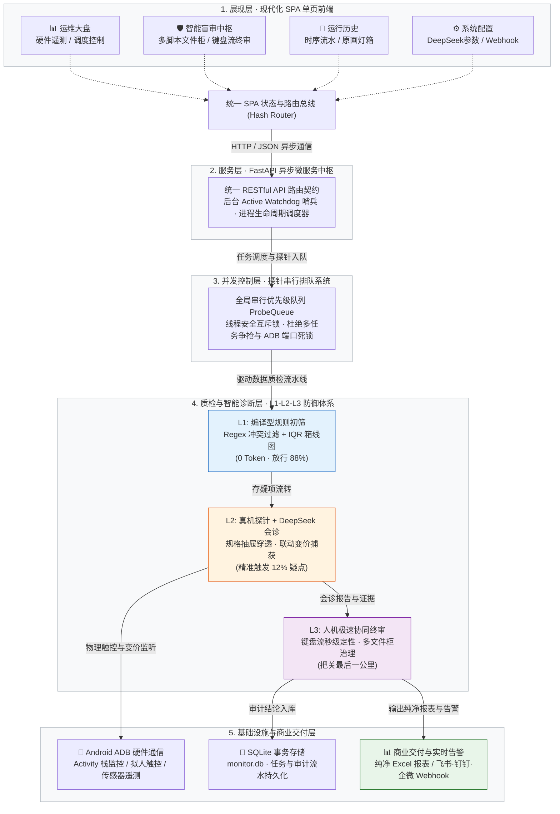
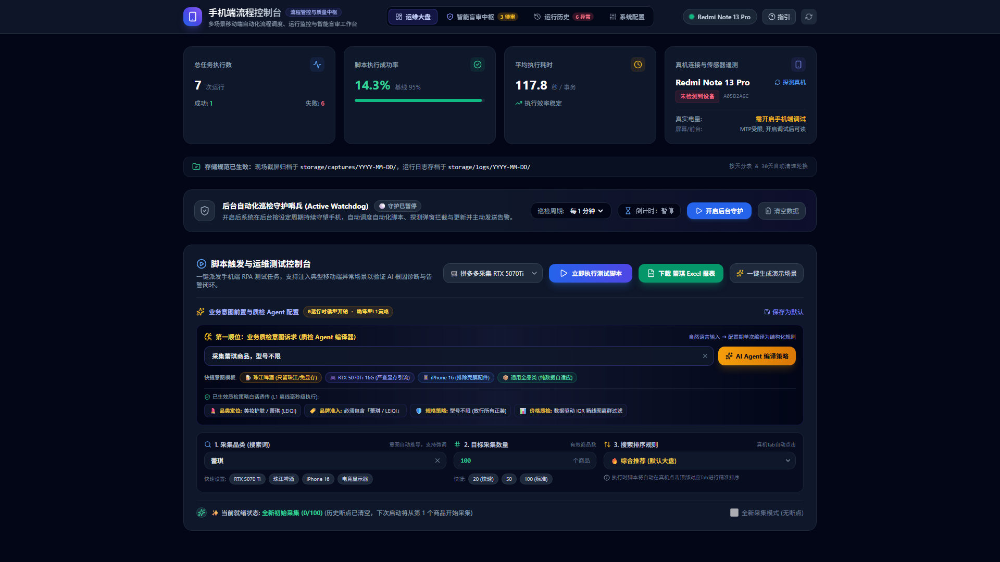
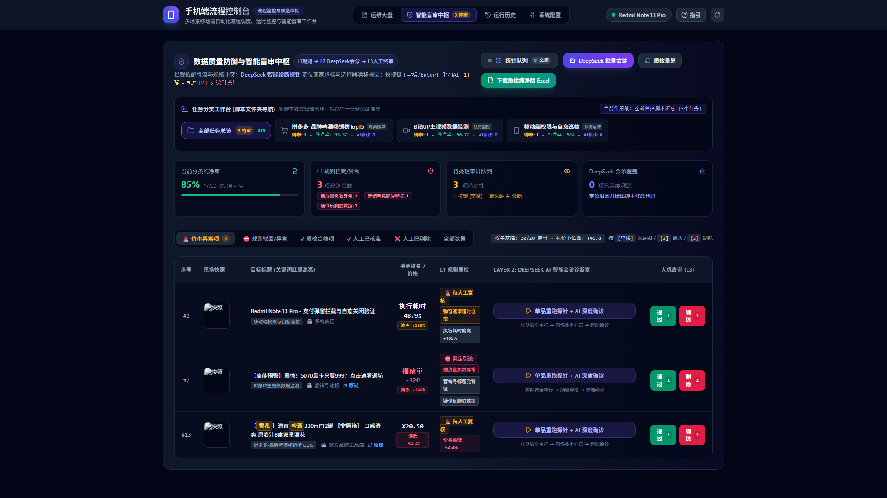
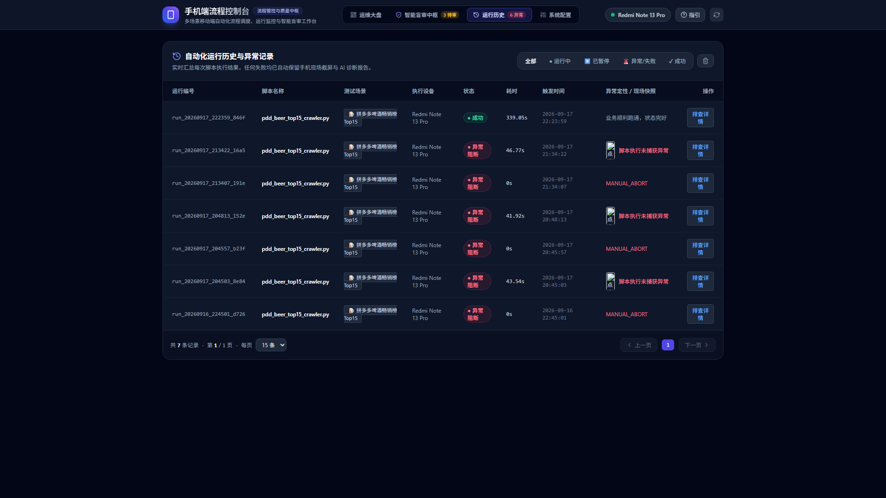
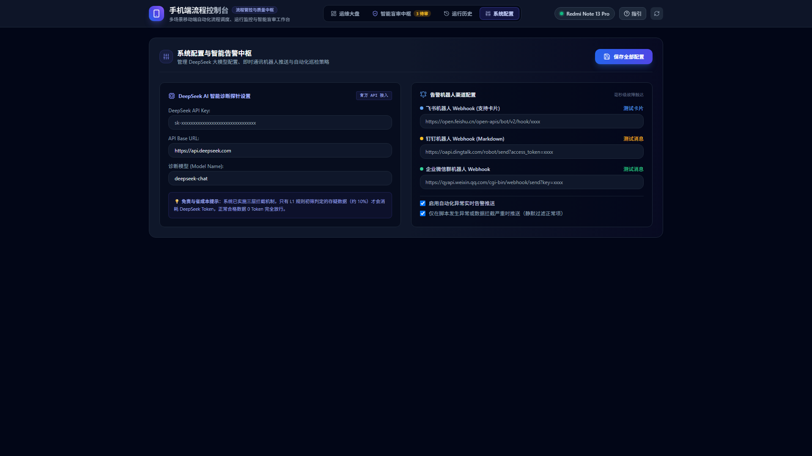

# 📱 Mobile Console System · 手机端自动化运维与数据质检控制台
### 基于 FastAPI + 现代化 SPA + 真机探针串行调度 + DeepSeek AI 智能盲审的移动端 RPA 统一管控中枢

[](https://www.python.org/)
[](https://fastapi.tiangolo.com/)
[](https://www.deepseek.com/)
[](https://developer.android.com/studio/command-line/adb)
[](DECISIONS.md)
[](#)

> **告别面条式单脚本裸跑，构建企业级移动端 RPA 调度与数据质检中枢** —— 解决移动端自动化“运行成功但数据失真、缺少硬件遥测、异常中断黑盒、多脚本管理混乱”四大行业死穴。集成 **L1-L2-L3 三层数据质量防御体系** 与 **物理真机互斥排队调度**。

---

## 💡 为什么需要这个项目？

### 传统移动端自动化运维的四大死穴
1. **“流程运行全绿，但数据严重失真”**：传统 RPA 仅关注脚本流程是否抛异常，无力应对电商平台复杂的低配引流、阴阳 SKU 与虚假标价，采集回来的大盘数据彻底失真；
2. **黑盒运行缺乏硬件遥测**：无法实时感知物理手机的电量、传感器温度、连接状态与前台 Activity 栈，手机过热或熄屏导致大面积任务静默失败；
3. **资源争抢导致 ADB 端口死锁**：当多个采数任务或单品探针并发执行时，ADB 通道、输入法与 UI Automator 产生激烈资源争抢，导致真机无响应；
4. **单脚本堆叠与全量大模型成本失控**：脚本各自为政，缺乏统一文件柜式管理；若全量调用大模型逐条分析，单批次 Token 成本极其昂贵且延时不可控。

---

## 🛡️ 核心破局方案：L1-L2-L3 三层数据质量防御体系

为了以极低成本实现商业级 100% 可信数据交付，系统摒弃了“全盘调用大模型”的昂贵粗暴方案，确立了阶梯式漏斗防御架构：



### 1. L1 本地规则轻量初筛（0 Token 成本，放行 ~88%）
- **多规格冲突与配件正则**：毫秒级捕获标题中的 `12G/16G`、`5070/5070Ti` 混写，以及“定金/延长线/支架/散热器”等低价配件特征；
- **IQR 价格箱线图离群度校验**：动态计算当前批次中位数与四分位距，对严重偏离大盘区间的异常低价打标拦截；
- **零成本前置过滤**：放行 88% 的合规正常数据，仅把 12% 模糊存疑项送入后续环节。

### 2. L2 物理探针重跑 + DeepSeek 智能会诊（精准触发 12% 疑点）
- **绝不凭空脑补 (Zero Hallucination)**：当数据存疑时，调度真机探针进入目标商品详情，自动触控展开规格抽屉（Bottom Sheet），穿透商家默认勾选的低配诱饵并选中目标规格卡片，读取屏幕联动变价；
- **大模型智能确诊**：将探针采集到的“首屏标价、抽屉初始选项、选中后跳变价格”等客观事实喂送给 **DeepSeek AI 诊断引擎**，输出高置信度定性：
  - `CONFIRMED_FRAUD_CORRECTED`：证实存在引流，但探针已成功锁定真实售价（如首屏 ¥7299 纠偏至 ¥9799）；
  - `FRAUD_EXCLUDED`：证实为纯配件或虚标引流，大盘剔除；
  - `LEGITIMATE`：真实合规商品。

### 3. L3 人机极速协同终审与纯净导出（把关最后一公里）
- **人机闭环设计哲学**：
  - 彻底摒弃“纯靠 AI 黑盒不可控”与“纯靠人工挑刺成本高昂”两个极端；
  - 90% 的脏活、重活由 L1+L2 自动完成，人工仅在 L3 做关键裁决，实现商业级 100% 准确率交付；
- **键盘流极速终审 (Zero-Friction Keyboard Workflow)**：
  - 针对审核员痛点，在盲审中枢提供极简键盘按键映射：
    - 按 `[空格]` 或 `[Enter]`：一键快速采纳 DeepSeek AI 的诊断与纠偏建议；
    - 按 `[1]` 键：快捷确认通过（`PASS`，核准录入）；
    - 按 `[2]` 键：快捷剔除引流（`REJECT`，标记违规）；
    - 整批次 20~50 条存疑项可在数十秒内快速过审，操作耗时缩减 95% 以上；
- **多脚本分类文件柜 (Multi-Script Workbench)**：
  - 在数据库底层解耦 `script_name`、`task_title`、`category`；
  - 每个业务脚本拥有独立的待审队列、分类纯净率 KPI 看板与历史审计归档，彻底告别多任务数据混杂；
- **纠偏真实售价直达纯净 Excel (`/api/reports/{script_name}/excel-clean`)**：
  - 终审完成后一键下载纯净报表，系统自动剔除已被标记违规的脏数据，将 L2 探针测得的真实纠偏价、店铺、短链导出为标准 Excel。

---

## 🖥️ 真实交互界面与视觉证明链 (UI Proof of Concept)

系统本地实机运行并在 Chrome 1920x1080 视口下真实捕获的 4 大核心页面：

### 1. 📊 运维大盘与任务调度中枢 (`/#dashboard`)
> 呈现总执行数、脚本成功率、平均耗时；实时轮询物理真机（Redmi Note 13 Pro 5G）连接与传感器电量温度；集成后台自动化巡检守护哨兵；提供采数三参数（品类、数量、排序规则）动态配置盒与编译型质检策略透传。


### 2. 🛡️ 数据质量防御与智能盲审中枢 (`/#audit`)
> 多脚本文件柜工作台（全部任务、拼多多采数、B站监控、系统运维）；分类纯净率 KPI 看板；L1 规则初筛拦截标签；集成【单品重跑探针 + AI 深度确诊】触发室与 L3 快捷人机定性操作台。


### 3. 📜 自动化运行历史与异常归档 (`/#history`)
> 完整汇总每次运行流水号、所属脚本、耗时时序、状态徽章与中断原因；支持原画截屏灯箱放大与异常归档回溯。


### 4. ⚙️ 系统配置与智能告警中枢 (`/#settings`)
> 集中管理 DeepSeek 官方大模型参数（支持 API Key 安全脱敏与 Base URL 自定义）；内置飞书卡片、钉钉 Markdown、企业微信群机器人三通道 Webhook 实时故障与质检推送配置。


---

## ⚙️ 核心技术模块解析

1. **物理真机串行排队队列 (`backend/probe_queue.py`)**：
   - 解决多任务并发争抢物理手机的问题：所有 `replay-probe` 任务进入全局串行优先级队列（`QUEUED` 状态）；
   - 后台守护线程严格一次只调度一个真机探针动作，前端动态轮询排队位次与倒计时，底层 100% 杜绝 ADB 端口碰撞；
2. **意图前置与规则编译型质检 Agent**：
   - 在任务触发前，通过 Agent 将自然语言诉求（如“只要显卡不要配件”）单次离线编译为结构化 L1 正则与价格离散区间，**运行时零模型开销**；
3. **生物级拟人防风控与弹窗自愈**：
   - 70ms~150ms 真实物理触控、180ms~420ms 视觉反应随机微等待；
   - 毫秒级探测领券、拼单引导等临时遮挡弹窗并安全消除，确保前台长周期无人值守稳定性。

---

## 🚀 快速上手与运行指南

### 1. 环境准备
确保本机安装了 Python 3.10+，并安装所需依赖包：
```bash
pip install -r requirements.txt
```

### 2. 配置环境变量（可选）
复制 `.env.example` 为 `.env`，可填入您的 DeepSeek API Key 或告警 Webhook（亦可在 Web 控制台「系统配置」页面直接录入）：
```bash
copy .env.example .env
```

### 3. 一键启动控制台
双击运行根目录下的 `一键启动控制台.bat`，或在命令行执行：
```bash
python launch_web.py
```
- 后端服务将在 `http://127.0.0.1:8000` 启动，并自动唤起默认浏览器；
- 如需静默运行（不自动开浏览器），可使用：`python launch_web.py --no-browser`。

---

## 🏛️ 研发决策与演进记录 (DECISIONS.md)
本项目严格遵循全局研发宪法，所有方案推翻与实测拍板历史均详尽记录于根目录下的 [DECISIONS.md](DECISIONS.md)（累计沉淀 35 项核心 ADR 记录）与 [HANDOVER.md](HANDOVER.md)。
